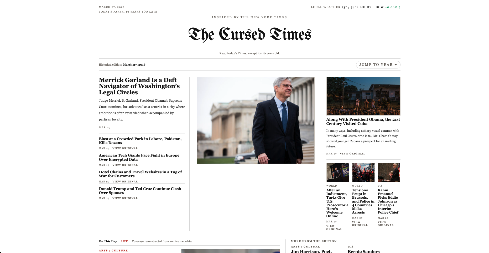

# The Cursed Times

The Cursed Times is a daily historical homepage that reconstructs what The New York Times was covering on the same month and day, years earlier.

Instead of browsing a generic archive, the site is always anchored to today. You land on "today's paper" from the past, can jump to any historical year, and read a reconstructed NYT-style front page built from archive metadata.

The goal is to make recent history feel immediate, uncanny, and oddly current.

## What It Does

- Reconstructs a newspaper-style homepage for the same month/day in a selected past year
- Defaults to 10 years earlier, but supports arbitrary year jumps
- Uses NYT Archive metadata as the primary source for article data
- Adapts the layout for image-rich and text-only eras
- Adds lightweight historical context with market data, local weather, and a Books module when available

## Homepage Example

## Local development

1. Install dependencies with `npm install`
2. Copy `.env.example` to `.env.local`
3. Add `NYT_ARCHIVE_API_KEY` if available
4. Run `npm run dev`

## Architecture Overview

At request time, the app computes the target historical date from today's date and the selected year. It then tries to load a fully rendered edition payload from cache before doing any live NYT work.

If a rendered edition is missing, the server checks for cached raw NYT month data. On a miss, it fetches the month from the NYT Archive API, normalizes the articles, filters them to the exact day, ranks them into a homepage-like structure, and stores the final rendered edition for future requests.

Books data follows the same pattern for supported years: check cache first, call the NYT Books API on miss, normalize the result, and merge it into the final edition payload.

The frontend mostly consumes a ready-to-render edition JSON object. Layout logic then decides how to present that edition as an image-led or text-led newspaper page.

## Caching

- Raw NYT archive month responses are cached under `nyt/archive/...`
- NYT Books responses are cached under `nyt/books/...`
- Fully rendered editions are cached under `editions/...`
- In local development, these caches are stored under `.cache/cursed-times-store`
- On Vercel, the same cache keys are stored in Vercel Blob when `BLOB_READ_WRITE_TOKEN` is available

This means cached editions and raw NYT data are shared across all users, so repeat traffic does not keep hitting NYT directly.

`GET /api/precompute` warms the common years for the current day ahead of traffic.
